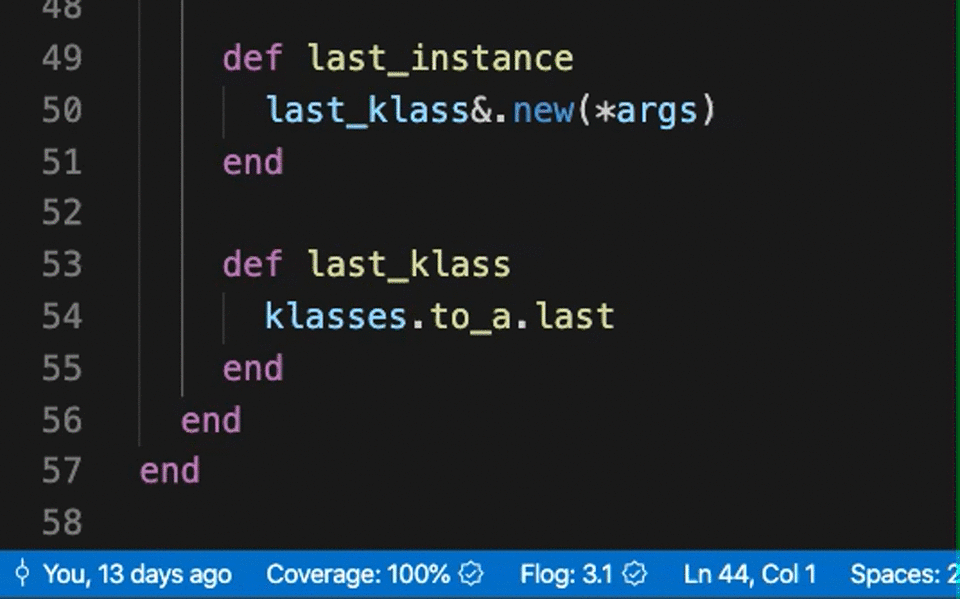

# Ruby Flog

Ruby Flog is a Visual Studio Code plug-in that runs flog locally against your
code and displays relevant metrics in the status bar. By default, it displays
the average flog per method in the selected file. Or, you can select some text
and Ruby Flog will display the total flog for the selected text. This is handy
when you want to see if your refactoring had an effect on a method's flog.

## Requirements

In order to use this extension you need to have Ruby and the flog gem
installed. The plugin will use your system Ruby. We recommend setting a global
Ruby version using a tool like `rbenv`, then run `gem install flog`:

    $ rbenv global 2.7.1
    $ gem install flog

If you are using RVM, run:

    $ rvm use system
    $ gem install flog

Or if you are using chruby:

    $ chruby system
    $ gem install flog

## Release Notes

Please see our [CHANGELOG][cl].

## Contributing

Bug reports and pull requests are welcome on [GitHub][git].

## License

The plugin is available as open source under the terms of the [MIT License][mit].

## Code of Conduct

Everyone interacting in the project's codebases, issue trackers, chat rooms and
mailing lists is expected to follow the [code of conduct][cod].

[cl]: https://github.com/first-try-software/vs-code-ruby-flog/blob/main/CHANGELOG.md
[git]: https://github.com/first-try-software/vs-code-ruby-flog
[cod]: https://github.com/first-try-software/vs-code-ruby-flog/blob/main/CODE_OF_CONDUCT.md
[mit]: https://opensource.org/licenses/MIT
